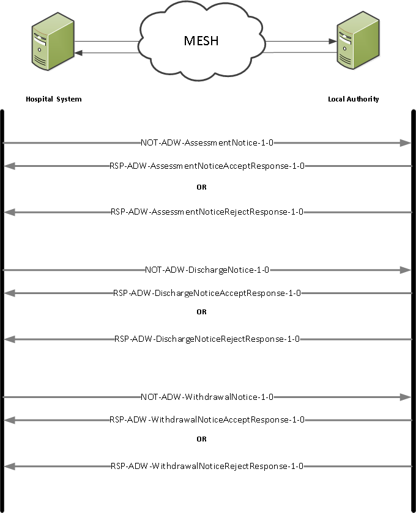

## FHIR Messaging Implementation and Architecture ##

**Assessment, Discharge and Withdrawal Dataset**

This section provides Assessment, Discharge and Withdrawal Dataset implementers with the information required to utilise the Assessment, Discharge and Withdrawal Dataset Domain Message Specification.

All the messages for the Assessment, Discharge and Withdrawal Dataset FHIR interface are based on the [HL7 FHIR DSTU2 1.0.2 Messaging Implementation] (Oct 2015) Messaging Implementation and supports multiple interactions. 

In addition to the standard acknowledgements and responses provided by MESH, a number of business responses are defined using the FHIR standard. The relevant MESH documentation should be consulted for further information.

----------

**NOT-ADW-AssessmentNotice-1 Interaction** 

The sending hospital system will construct an Assessment Notice and send it to the receiving local authority system.

- *Sender:* Hospital sending system
- *Receiver:* Local authority receiving system
- *Message: Wire Format:* [ADW-AssessmentNotice-1]

**Acknowledgements**

Standard MESH acknowledgements are utilised.

**Responses**

The receiving local authority system **must** send one of the following responses:

*Assessment Notice Accept Response* - [RSP-ADW-AssessmentNoticeAcceptResponse-1](#RSP-ADW-AssessmentNoticeAcceptResponse-1)

**OR**

*Assessment Notice Reject Response* - [RSP-ADW-AssessmentNoticeRejectResponse-1](#RSP-ADW-AssessmentNoticeRejectResponse-1)

----------

** RSP-ADW-AssessmentNoticeAcceptResponse-1 Interaction** 

If accepting the Assessment Notice the local authority system will construct an Assessment Notice Accept Response and send it to the hospital system.

- *Sender:* Local authority sending system
- *Receiver:* Hospital receiving system
- *Message:* *Wire Format:* [ADW-AssessmentNoticeAcceptResponse-1]

**Acknowledgements**

Standard MESH acknowledgements are utilised.

----------

** RSP-ADW-AssessmentNoticeRejectResponse-1 Interaction** 

If rejecting the Assessment Notice the local authority system will construct an Assessment Notice Reject Response and send it to the hospital system.

- *Sender:* Local authority sending system
- *Receiver:* Hospital receiving system
- *Message:* *Wire Format:* [ADW-AssessmentNoticeRejectResponse-1]

**Acknowledgements**

Standard MESH acknowledgements are utilised.

----------

**NOT-ADW-DischargeNotice-1 Interaction** 

The sending hospital system will construct a Discharge Notice and send it to the receiving local authority system.

- *Sender:* Hospital sending system
- *Receiver:* Local authority receiving system
- *Message:*  *Wire Format:* [ADW-DischargeNotice-1]

**Acknowledgements**

Standard MESH acknowledgements are utilised.

**Responses**

The receiving local authority system **must** send one of the following responses:

*Discharge Notice Accept Response* - [RSP-ADW-DischargeNoticeAcceptResponse-1](#RSP-ADW-DischargeNoticeAcceptResponse-1)

**OR**

*Discharge Notice Reject Response* - [RSP-ADW-DischargeNoticeRejectResponse-1](#RSP-ADW-DischargeNoticeRejectResponse-1)

----------

** RSP-ADW-DischargeNoticeAcceptResponse-1 Interaction** 

If accepting the Discharge Notice the local authority system will construct a Discharge Notice Accept Response and send it to the hospital system.

- *Sender:* Local authority sending system
- *Receiver:* Hospital receiving system
- *Message:* *Wire Format:* [ADW-DischargeNoticeAcceptResponse-1]

**Acknowledgements**

Standard MESH acknowledgements are utilised.

----------

** RSP-ADW-DischargeNoticeRejectResponse-1 Interaction** 

If rejecting the Discharge Notice the local authority system will construct a Discharge Notice Reject Response and send it to the hospital system.

- *Sender:* Local authority sending system
- *Receiver:* Hospital receiving system
- *Message:* *Wire Format:* [ADW-DischargeNoticeRejectResponse-1]

**Acknowledgements**

Standard MESH acknowledgements are utilised.

----------

**NOT-ADW-WithdrawalNotice-1 Interaction** 

The sending hospital system will construct a Withdrawal Notice and send it to the receiving local authority system.

- *Sender:* Hospital sending system
- *Receiver:* Local authority receiving system
- *Message: Wire Format:* [ADW-WithdrawalNotice-1]

**Acknowledgements**

Standard MESH acknowledgements are utilised.

**Responses**

The receiving local authority system **should** send one of the following responses:

*Withdrawal Notice Accept Response* - [RSP-ADW-WithdrawalNoticeAcceptResponse-1](#RSP-ADW-WithdrawalNoticeAcceptResponse-1)

**OR**

*Withdrawal Notice Reject Response* - [RSP-ADW-WithdrawalNoticeRejectResponse-1](#RSP-ADW-WithdrawalNoticeRejectResponse-1)

----------

** RSP-ADW-WithdrawalNoticeAcceptResponse-1 Interaction** 

If accepting the Withdrawal Notice the local authority system will construct a Withdrawal Notice Accept Response and send it to the hospital system.

- *Sender:* Local authority sending system
- *Receiver:* Hospital receiving system
- *Message: Wire Format:* [ADW-WithdrawalNoticeAcceptResponse-1]

**Acknowledgements**

Standard MESH acknowledgements are utilised.

----------

** RSP-ADW-WithdrawalNoticeRejectResponse-1 Interaction** 

If rejecting the Withdrawal Notice the local authority system will construct a Withdrawal Notice Reject Response and send it to the hospital system.

- *Sender:* Local authority sending system
- *Receiver:* Hospital receiving system
- *Message:* *Wire Format:* [ADW-WithdrawalNoticeRejectResponse-1]

**Acknowledgements**

Standard MESH acknowledgements are utilised.

----------

**Assessment, Discharge and Withdrawal Interactions Diagram**
 

The diagram shows the Assessment, Discharge and Withdrawal Interactions:

 

  
 

**FHIR Messaging**

The FHIR messages are made up of the resources which are bundled within an FHIR Bundle wrapper to create the FHIR structure.

For the purpose of this implementation guide, the FHIR resources are bundled together to construct a FHIR Message payload.

In FHIR messaging, a "message" is sent from a source application to a destination application when an event happens. Events mostly correspond to things that happen in the real world. The message consists of a bundle identified by the tag "http://hl7.org/fhir/tag/message", with the first resource in the bundle being a MessageHeader resource.

**Further Information**
  
For more information about FHIR messaging please visit: [HL7 FHIR DSTU2 1.0.2 Messaging Implementation]

[HL7 FHIR DSTU2 1.0.2 Messaging Implementation]:http://hl7.org/fhir/DSTU2/messaging.html

[ADW-AssessmentNotice-1]: ../Profile.ADW-AssessmentNotice/Profile.ADW-AssessmentNotice.html

[ADW-AssessmentNoticeAcceptResponse-1]: ../Profile.ADW-AssessmentNoticeAcceptResponse/Profile.ADW-AssessmentNoticeAcceptResponse.html

[ADW-AssessmentNoticeRejectResponse-1]: ../Profile.ADW-AssessmentNoticeRejectResponse/Profile.ADW-AssessmentNoticeRejectResponse.html

[ADW-DischargeNotice-1]: ../Profile.ADW-DischargeNotice/Profile.ADW-DischargeNotice.html

[ADW-DischargeNoticeAcceptResponse-1]: ../Profile.ADW-DischargeNoticeAcceptResponse/Profile.ADW-DischargeNoticeAcceptResponse.html

[ADW-DischargeNoticeRejectResponse-1]: ../Profile.ADW-DischargeNoticeRejectResponse/Profile.ADW-DischargeNoticeRejectResponse.html

[ADW-WithdrawalNotice-1]: ../Profile.ADW-WithdrawalNotice/Profile.ADW-WithdrawalNotice.html

[ADW-WithdrawalNoticeAcceptResponse-1]: ../Profile.ADW-WithdrawalNoticeAcceptResponse/Profile.ADW-WithdrawalNoticeAcceptResponse.html

[ADW-WithdrawalNoticeRejectResponse-1]: ../Profile.ADW-WithdrawalNoticeRejectResponse/Profile.ADW-WithdrawalNoticeRejectResponse.html