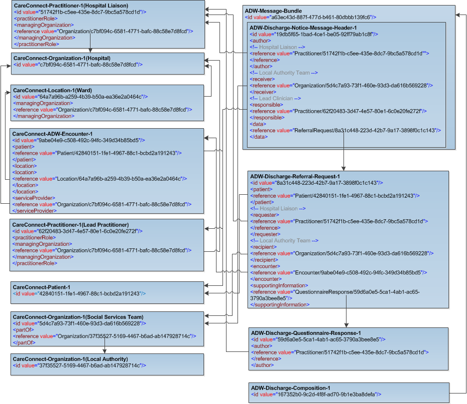

The Discharge Notice ADW-Message-Bundle-1-0 bundle resource profile is used in the ADW interfaces as a container to collect the ADW profiles in the following combined order: 

- ADW-DischargeNotice-Message-Header-1-0 [ADW-DischargeNotice-Message-Header-1-0]
- ADW-DischargeReferralRequest-1-0 [ADW-DischargeReferralRequest-1-0]
- ADW-Patient-1-0 [ADW-Patient-1-0]
- ADW-Practitioner-1-0 [ADW-Practitioner-1-0]
- ADW-Lead-Clinician-Practitioner-1-0 [ADW-Lead-Clinician-Practitioner-1-0]
- ADW-Organization-1-0 [ADW-Organization-1-0]
- ADW-Social-Services-Team-Organization-1-0 [ADW-Social-Services-Team-Organization-1-0]
- ADW-DischargeQuestionnaireResponse-1-0 [ADW-DischargeQuestionnaireResponse-1-0]
- ADW-Discharge-Encounter-1-0 [ADW-Discharge-Encounter-1-0]
- ADW-Location-1-0 [ADW-Location-1-0]
- ADW-Discharge-Composition-1-0 [ADW-Discharge-Composition-1-0] 

----------

Example of the Discharge Notice Bundle with ADW Data set fields populated [ADW-Message-DischargeNotice-1-0-Ex01.xml] 

The following example contains a composition resource and has been a .txt extension only to allow correct viewing within a web browser, xml copies are available within the examples folder within this specification.

Example of the Discharge Notice Bundle with ADW Data set fields + optional FHIR elements populated [ADW-Message-DischargeNotice-1-0-Ex02.txt] 

Note: Only the ADW data set fields are supported by the National Adapter and therefore optional data will not be retained within transformed messages. Optional data in FHIR messages that are "passed through" the adapter will not be removed.

----------

[ADW-Message-DischargeNotice-1-0-Ex01.xml]: ../Examples/Profile.ADW-DischargeNotice/ADW-Message-DischargeNotice-1-0-Ex01.xml

[ADW-Message-DischargeNotice-1-0-Ex02.txt]: ../Examples/Profile.ADW-DischargeNotice/ADW-Message-DischargeNotice-1-0-Ex02.txt

###  ADW Data set Mapping for ADW Discharge Notice message bundle. ###

----------

| REQUIRED DATA FIELD                          | FHIR PROFILE ELEMENT                             |
|----------------------------------------------|--------------------------------------------------|
| **Discharge Notice**                         |                                                  |
| Discharge Notice Issued Date                 | [MessageHeader.timestamp (ADW Message Sent Time)]                |
| **Patient Identifiers**                      |                                                  |
| Patient NHS Number                           | [Patient.identifier (NHS Number)]                         |
| NHS Number Status Indicator                  | [Patient.identifier.type (NHS Number Status Indicator)]                                    |
| Hospital Patient Identifier                  | [Patient.identifier (Hospital Patient Identifier)]                                   |
| **Patient Name**                             |                                                  |
| Family Name                                  |[Patient.name.family (Family Name)]                                       |
| First Given Name                             |[Patient.name.given (First Given Name)]                                       |
| **Patient Birth Date**                       |                                                  |
| Patient Birth Date                           |[Patient.birthDate (Patient Birth Date)]                                         |
| **Person Stated Gender**                     |                                                  |
| Patient Stated Gender                         |[Patient.gender (Patient stated gender)]                                           |
| **Patient Address**                          |                                                  |
| Address Line 1                               |[Patient.address.line]                                      |
| Address Line 2                               |[Patient.address.line]                                     |
| Address Line 3                               |[Patient.address.line]                                     |
| Address Line 4                               |[Patient.address.city]                                     |
| Address Line 5                               |[Patient.address.district (County)]                                     |
| Postcode                                     |[Patient.address.postalCode]                               
| **Hospital**                                 |                                                  |
| Organization Site Code                       |[Organization.identifier (Organization Site Code)]                                         |
| Hospital Name                                |[Organization.name (Hospital/Local Authority)]                                              |
| Ward Name                                    |[Location.name (Ward)]                                              |
| **Proposed Discharge Date**                  |                                                  |
| Proposed Discharge Date                      |[Discharge Encounter.period.end (Inpatient Stay Period)]                                       |
| **Discharge Date Informed Status**           |                                                  |
| Discharge Notice Patient Consulted Indicator | [group.question.answer.value (Patient Consulted)]                                    |
| Discharge Notice Carer Consulted Indicator   | [group.question.answer.value (Carer Consulted)]    |
| **Lead Clinician Name**                      |                                                  |
| Family Name                                  | [Lead Clinician.name.family (Family Name)]                                      |
| First Given Name                             | [Lead Clinician.name.given (First Given Name)]                                      |
| **Hospital Liaison Name**                    |                                                  |
| Family Name                                  | [Practitioner.name.family (Family Name - Hospital Liaison)]                             |
| First Given Name                             | [Practitioner.name.given (First Given Name - Hospital Liaison)]                             |
| **Hospital Liaison Contact Details**         |                                                  |
| Hospital Liaison Email Address               | [Practitioner.telecom.value (Hospital Liaison Email)]                                        |
| Hospital Liaison Telephone Number            | [Practitioner.telecom.value (Hospital Liaison Telephone no.)]                                |
| **Carer Name**                               |                                                                   |
| Family Name                                  | [Patient.contact.name.family (Family Name - Carer)]                                        |
| First Given Name                             | [Patient.contact.name.given (First Given Name - Carer)]                                      |
| **Carer Contact Details**                    |                                                                   |
| Carer Email Address                          | [Patient.contact.telecom.value (Carer Email)]                                                           |
| Carer Telephone Number                       | [Patient.contact.telecom.value (Carer Telephone no.)]                                          |
| **Local Authority**                          |                                                  |
| Organization Site Code                       | [Organization.identifier (Organization Site Code)]                                         |
| Local Authority Name                         | [Organization.name (Hospital/Local Authority)]                                             |
| Social Services Team                         | [Organization.name (Social Services' team)]                                             |

----------

###  Profile Referencing Diagram for a Discharge Notice #

The FHIR profiles in the message are referenced in the XML instance instead of being contained. 

This means only one instance is required for each instance of the profile.

The diagram below shows the referencing for a typical Discharge Notice message. It is intended for illustrative purposes only.

  
 

[ADW-DischargeNotice-Message-Header-1-0]: adw-discharge-notice-message-header-1-0.html
[ADW-DischargeReferralRequest-1-0]: adw-discharge-referral-request-1-0.html
[ADW-Patient-1-0]: adw-patient-1-0.html
[ADW-Practitioner-1-0]: adw-practitioner-1-0.html
[ADW-Lead-Clinician-Practitioner-1-0]: adw-lead-clinician-practitioner-1-0.html
[ADW-Organization-1-0]: adw-organization-1-0.html
[ADW-DischargeQuestionnaireResponse-1-0]: adw-discharge-questionnaire-response-1-0.html
[ADW-Discharge-Encounter-1-0]: adw-discharge-encounter-1-0.html
[ADW-Social-Services-Team-Organization-1-0]: adw-social-services-team-organization-1-0.html
[ADW-Location-1-0]: adw-location-1-0.html
[ADW-Discharge-Composition-1-0]: adw-discharge-composition-1-0.html

[MessageHeader.timestamp (ADW Message Sent Time)]: adw-discharge-notice-message-header-1-0-dict.html#MessageHeader.ADW%20Message%20Sent%20Time
[Patient.identifier (NHS Number)]: adw-patient-1-0-dict.html#Patient.NHS%20Number
[Patient.identifier.type (NHS Number Status Indicator)]: adw-patient-1-0-dict.html#Patient.identifier.NHS%20Number%20Status%20Indicator  
[Patient.identifier (Hospital Patient Identifier)]: adw-patient-1-0-dict.html#Patient.Hospital%20Patient%20Identifier 
[Patient.name.family (Family Name)]: adw-patient-1-0-dict.html#Patient.name.Family%20name
[Patient.name.given (First Given Name)]: adw-patient-1-0-dict.html#Patient.name.First%20given%20name
[Patient.birthDate (Patient Birth Date)]: adw-patient-1-0-dict.html#Patient.Patient%20Birth%20Date
[Patient.gender (Patient stated gender)]: adw-patient-1-0-dict.html#Patient.Patient%20stated%20gender
[Patient.address.line]: adw-patient-1-0-dict.html#Patient.address.line
[Patient.address.city]: adw-patient-1-0-dict.html#Patient.address.city
[Patient.address.district (County)]: adw-patient-1-0-dict.html#Patient.address.County
[Patient.address.postalCode]: adw-patient-1-0-dict.html#Patient.address.postalCode
[Organization.identifier (Organization Site Code)]: adw-organization-1-0-dict.html#Organization.Organization%20Site%20Code
[Organization.name (Hospital/Local Authority)]: adw-organization-1-0-dict.html#Organization.Hospital%20or%20Local%20Authority%20Name
[Location.name (Ward)]: adw-location-1-0-dict.html#Location.Ward%20name
[Discharge Encounter.period.end (Inpatient Stay Period)]: adw-discharge-encounter-1-0-dict.html#Encounter.period.end
[Discharge Encounter.period.end (Inpatient Stay Period]: adw-discharge-encounter-1-0-dict.html#Encounter.period.end
[group.question.answer.value (Patient Consulted)]: adw-discharge-questionnaire-response-1-0-dict.html#QuestionnaireResponse.group.question.answer.Patient%20Consultation
[group.question.answer.value (Carer Consulted)]: adw-discharge-questionnaire-response-1-0-dict.html#QuestionnaireResponse.group.question.answer.Carer%20Consultation
[Lead Clinician.name.family (Family Name)]: adw-lead-clinician-practitioner-1-0-dict.html#Practitioner.name.Family%20name 
[Lead Clinician.name.given (First Given Name)]: adw-lead-clinician-practitioner-1-0-dict.html#Practitioner.name.First%20given%20name
[Practitioner.name.family (Family Name - Hospital Liaison)]: adw-practitioner-1-0-dict.html#Practitioner.name.Family%20name
[Practitioner.name.given (First Given Name - Hospital Liaison)]: adw-practitioner-1-0-dict.html#Practitioner.name.First%20given%20name
[Practitioner.telecom.value (Hospital Liaison Email)]: adw-practitioner-1-0-dict.html#Practitioner.telecom.Practitioner%20Email%20address%20string
[Practitioner.telecom.value (Hospital Liaison Telephone no.)]: adw-practitioner-1-0-dict.html#Practitioner.telecom.Practitioner%20Telephone%20number%20string
[identifier (Local Authority - ODS Organisation Code)]: adw-organization-1-0-dict.html#Organization.ODS%20Organisation%20Code
[Organization.name (Hospital/Local Authority)]: adw-organization-1-0-dict.html#Organization.Hospital%20or%20Local%20Authority%20Name
[Organization.name (Social Services' team)]: adw-social-services-team-organization-1-0-dict.html#Organization.Social%20Services%20team
[Patient.contact.name.family (Family Name - Carer)]: adw-patient-1-0-dict.html#Patient.contact.name.Family%20name
[Patient.contact.name.given (First Given Name - Carer)]: adw-patient-1-0-dict.html#Patient.contact.name.First%20given%20name
[Patient.contact.telecom.value (Carer Email)]: adw-patient-1-0-dict.html#Patient.contact.telecom.Carer%20Email%20address%20string
[Patient.contact.telecom.value (Carer Telephone no.)]: adw-patient-1-0-dict.html#Patient.contact.telecom.Carer%20Telephone%20number%20string

----------

**Further Information**

For more information about message profiles visit the [Profiling FHIR] and for resource Metadata visit [Base Resource Definitions].

The various downloads (including Schema files) and reference implementations are available on [FHIR website].

[Profiling FHIR]: http://hl7.org/fhir/profiling.html
[FHIR website]: http://hl7.org/fhir/index.html
[Base Resource Definitions]: http://hl7.org/fhir/resource.html
