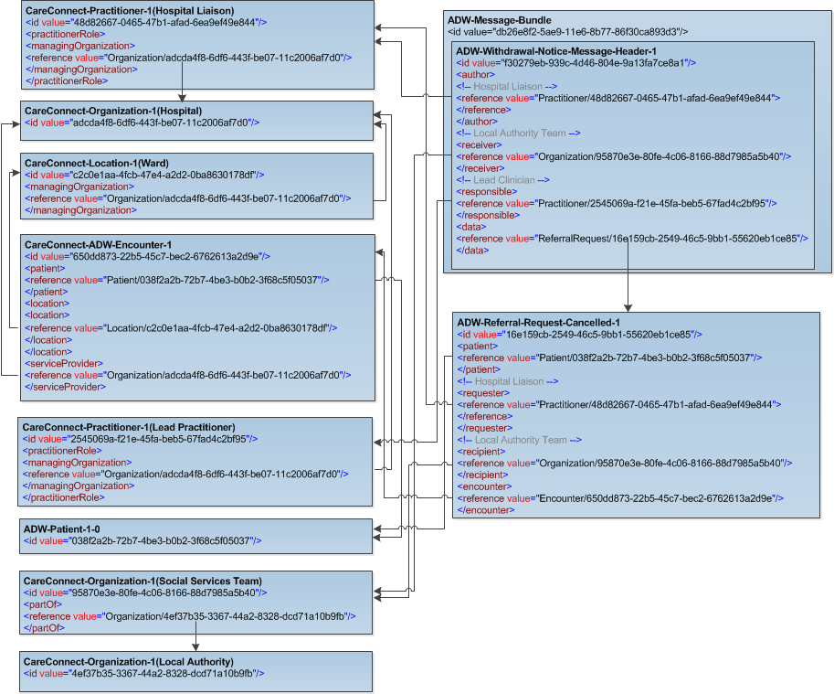

The ADW-Message-Bundle-1-0 bundle resource profile is used in the ADW interfaces as a container to collect the ADW profiles in the following combined order: 

- ADW-WithdrawalNotice-Message-Header-1-0 [ADW-WithdrawalNotice-Message-Header-1-0]
- ADW-ReferralRequest-Cancelled-1-0 [ADW-ReferralRequest-Cancelled-1-0]
- ADW-Patient-1-0 [ADW-Patient-1-0]
- ADW-Practitioner-1-0 [ADW-Practitioner-1-0]
- ADW-Lead-Clinician-Practitioner-1-0 [ADW-Lead-Clinician-Practitioner-1-0]
- ADW-Organization-1-0 [ADW-Organization-1-0]
- ADW-Social-Services-Team-Organization-1-0 [ADW-Social-Services-Team-Organization-1-0]
- ADW-Withdrawal-Encounter-1-0 [ADW-Withdrawal-Encounter-1-0]
- ADW-Location-1-0 [ADW-Location-1-0]

----------

Example of the Withdrawal Notice Bundle with ADW Data set fields populated [ADW-Message-WithdrawalNotice-1-0-Ex01.xml]

Example of the Withdrawal Notice Bundle with ADW Data set fields + optional FHIR elements populated [ADW-Message-WithdrawalNotice-1-0-Ex02] 

Note: Only the ADW data set fields are supported by the National Adapter and therefore optional data will not be retained within transformed messages. 
Optional data in FHIR messages that are "passed through" the adapter will not be removed.

----------

[ADW-Message-WithdrawalNotice-1-0-Ex01.xml]: ../Examples/Profile.ADW-WithdrawalNotice/ADW-Message-WithdrawalNotice-1-0-Ex01.xml

[ADW-Message-WithdrawalNotice-1-0-Ex02]: ../Examples/Profile.ADW-WithdrawalNotice/ADW-Message-WithdrawalNotice-1-0-Ex02.xml

###  ADW Data set Mapping for ADW Withdrawal Notice message bundle. ###

----------

| REQUIRED DATA FIELD                  | FHIR PROFILE ELEMENT                             |
|--------------------------------------|--------------------------------------------------|
| **Withdrawal Notice**                |                                                  |
| Withdrawal Notice Issued Date        | [MessageHeader.timestamp (ADW Message Sent Time)]              |
| **Patient Identifiers**              |                                                  |
| Patient NHS Number                   | [Patient.identifier (NHS Number)]                          |
| NHS Number Status Indicator          | [Patient.identifier.type (NHS Number Status Indicator)]                            |
| Hospital Patient Identifier          | [Patient.identifier (Hospital Patient Identifier)]            |
| **Patient Name**                     |                                                  |
| Family Name                          | [Patient.name.family (Family Name)]                                     |
| First Given Name                     | [Patient.name.given (First Given Name)]                                       |
| **Patient Birth Date**               |                                                  |
| Patient Birth Date                   | [Patient.birthDate (Patient Birth Date)]                                      |
| **Person Stated Gender**             |                                                  |
| Patient Stated Gender                | [Patient.gender (Patient stated gender)]                                         |
| **Patient Address**                  |                                                  |
| Address Line 1                       | [Patient.address.line]                                   |
| Address Line 2                       | [Patient.address.line]                                   |
| Address Line 3                       | [Patient.address.line]                                   |
| Address Line 4                       | [Patient.address.city]                                   |
| Address Line 5                       | [Patient.address.district (County)]                                   |
| Postcode                             | [Patient.address.postalCode]                             |
| **Hospital**                         |                                                  |
| Organization Site Code               | [Organization.identifier (Organization Site Code)]             |
| Hospital Name                        | [Organization.name (Hospital/Local Authority)]                                |
| Ward Name                            | [Location.name (Ward)]                                     |
| **Withdrawal Type**                  |                                                  |
| Withdrawal type                      | [MessageHeader.event.code(Withdrawal Notice Type)]                  |
| **Reason for Withdrawal**            |                                                  |
| Reason for Withdrawal                | [MessageHeader.reason.coding.display]                          |
| **Reason For Withdrawal - Other**    |                                                  |
| Reason For Withdrawal - Other        | [MessageHeader.reason.text (Other Reason for Withdrawal)]                           |
| **Lead Clinician Name**              |                                                  |
| Family Name                          | [Lead Clinician.name.family (Family Name)]                   |
| First Given Name                     | [Lead Clinician.name.given (First Given Name)]                    |
| **Hospital Liaison Name**            |                                                  |
| Family Name                          | [Practitioner.name.family (Family Name - Hospital Liaison)]                              |
| First Given Name                     | [Practitioner.name.given (First Given Name - Hospital Liaison)]                              |
| **Hospital Liaison Contact Details** |                                                  |
| Hospital Liaison Email Address       | [Practitioner.telecom.value (Hospital Liaison Email)]               |
| Hospital Liaison Telephone Number    | [Practitioner.telecom.value (Hospital Liaison Telephone no.)]                                  |
| **Local Authority**                  |                                                  |
| Organization Site Code               | [Organization.identifier (Organization Site Code)]               |
| Local Authority Name                 | [Organization.name (Hospital/Local Authority)]                         |
| Social Services Team                 | [Organization.name (Social Services' team)] 

[ADW-WithdrawalNotice-Message-Header-1-0]: adw-withdrawal-notice-message-header-1-0.html
[ADW-ReferralRequest-Cancelled-1-0]: adw-referral-request-cancelled-1-0.html
[ADW-Patient-1-0]: adw-patient-1-0.html
[ADW-Practitioner-1-0]: adw-practitioner-1-0.html
[ADW-Lead-Clinician-Practitioner-1-0]: adw-lead-clinician-practitioner-1-0.html
[ADW-Organization-1-0]: adw-organization-1-0.html
[ADW-Withdrawal-Encounter-1-0]: adw-withdrawal-encounter-1-0.html
[ADW-Social-Services-Team-Organization-1-0]: adw-social-services-team-organization-1-0.html
[ADW-Location-1-0]: adw-location-1-0.html

[MessageHeader.timestamp (ADW Message Sent Time)]: adw-withdrawal-notice-message-header-1-0-dict.html#MessageHeader.ADW%20Message%20Sent%20Time
[Patient.identifier (NHS Number)]: adw-patient-1-0-dict.html#Patient.NHS%20Number
[Patient.identifier.type (NHS Number Status Indicator)]: adw-patient-1-0-dict.html#Patient.identifier.NHS%20Number%20Status%20Indicator  
[Patient.identifier (Hospital Patient Identifier)]: adw-patient-1-0-dict.html#Patient.Hospital%20Patient%20Identifier 
[Patient.name.family (Family Name)]: adw-patient-1-0-dict.html#Patient.name.Family%20name
[Patient.name.given (First Given Name)]: adw-patient-1-0-dict.html#Patient.name.First%20given%20name
[Patient.birthDate (Patient Birth Date)]: adw-patient-1-0-dict.html#Patient.Patient%20Birth%20Date
[Patient.gender (Patient stated gender)]: adw-patient-1-0-dict.html#Patient.Patient%20stated%20gender
[Patient.address.line]: adw-patient-1-0-dict.html#Patient.address.line
[Patient.address.city]: adw-patient-1-0-dict.html#Patient.address.city
[Patient.address.district (County)]: adw-patient-1-0-dict.html#Patient.address.County
[Patient.address.postalCode]: adw-patient-1-0-dict.html#Patient.address.postalCode
[Organization.identifier (Organization Site Code)]: adw-organization-1-0-dict.html#Organization.Organization%20Site%20Code
[Organization.name (Hospital/Local Authority)]: adw-organization-1-0-dict.html#Organization.Hospital%20or%20Local%20Authority%20Name
[Location.name (Ward)]: adw-location-1-0-dict.html#Location.Ward%20name
[MessageHeader.event.code(Withdrawal Notice Type)]: adw-withdrawal-notice-message-header-1-0-dict.html#MessageHeader.event.Withdrawal%20Notice%20Type
[MessageHeader.reason.coding.display]: adw-withdrawal-notice-message-header-1-0-dict.html#MessageHeader.reason.coding.display
[MessageHeader.reason.text (Other Reason for Withdrawal)]: adw-withdrawal-notice-message-header-1-0-dict.html#MessageHeader.reason.Other%20Reason%20for%20Withdrawal
[Lead Clinician.name.family (Family Name)]: adw-lead-clinician-practitioner-1-0-dict.html#Practitioner.name.Family%20name 
[Lead Clinician.name.given (First Given Name)]: adw-lead-clinician-practitioner-1-0-dict.html#Practitioner.name.First%20given%20name
[Practitioner.name.family (Family Name - Hospital Liaison)]: adw-practitioner-1-0-dict.html#Practitioner.name.Family%20name
[Practitioner.name.given (First Given Name - Hospital Liaison)]: adw-practitioner-1-0-dict.html#Practitioner.name.First%20given%20name
[Practitioner.telecom.value (Hospital Liaison Email)]: adw-practitioner-1-0-dict.html#Practitioner.telecom.Practitioner%20Email%20address%20string
[Practitioner.telecom.value (Hospital Liaison Telephone no.)]: adw-practitioner-1-0-dict.html#Practitioner.telecom.Practitioner%20Telephone%20number%20string
[identifier (Local Authority - ODS Organisation Code)]: adw-organization-1-0-dict.html#Organization.ODS%20Organisation%20Code
[Organization.name (Hospital/Local Authority)]: adw-organization-1-0-dict.html#Organization.Hospital%20or%20Local%20Authority%20Name
[Organization.name (Social Services' team)]: adw-social-services-team-organization-1-0-dict.html#Organization.Social%20Services%20team

----------

### Referencing of profiles for an ADW Withdrawal Notice message bundle.###

The diagram shows the referencing for a typical Withdrawal Notice message. It is intended for illustrative purposes only.

  
 

----------

**Further Information**

For more information about message profiles visit the [Profiling FHIR] and for resource Metadata visit [Base Resource Definitions].

The various downloads (including Schema files) and reference implementations are available on [FHIR website].

[Profiling FHIR]: http://hl7.org/fhir/profiling.html
[FHIR website]: http://hl7.org/fhir/index.html
[Base Resource Definitions]: http://hl7.org/fhir/resource.html