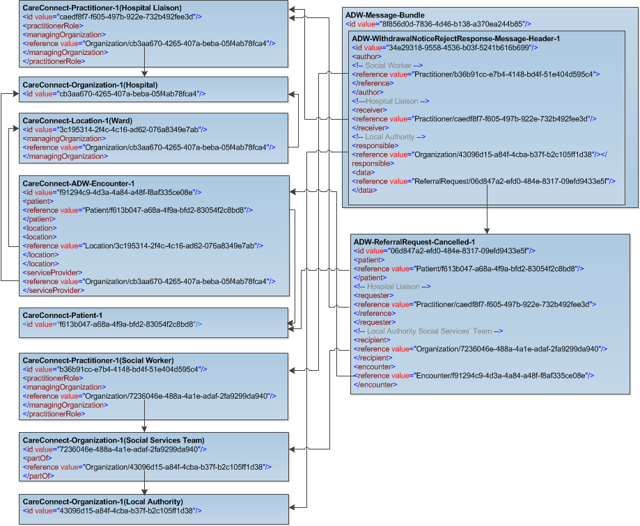

The ADW-Message-Bundle-1-0 bundle resource profile is used in the ADW interfaces as a container to collect the ADW profiles in the following combined order: 

- ADW-WithdrawalNoticeRejectResponse-Message-Header-1-0 [ADW-WithdrawalNoticeRejectResponse-Message-Header-1-0]
- ADW-ReferralRequest-Cancelled-1-0 [ADW-ReferralRequest-Cancelled-1-0]
- ADW-Patient-1-0 [ADW-Patient-1-0]
- ADW-Practitioner-1-0 [ADW-Practitioner-1-0]
- ADW-Organization-1-0 [ADW-Organization-1-0]
- ADW-Social-Services-Team-Organization-1-0 [ADW-Social-Services-Team-Organization-1-0]
- ADW-Response-Encounter-1-0 [ADW-Response-Encounter-1-0]
- ADW-Location-1-0 [ADW-Location-1-0]

----------

Example of the Withdrawal Notice Reject Response Bundle with ADW Data set fields populated [ADW-Message-WithdrawalNoticeRejectResponse-1-0-Ex01]

Example of the Withdrawal Notice Reject Response Bundle with ADW Data set fields + optional FHIR elements populated [ADW-Message-WithdrawalNoticeRejectResponse-1-0-Ex01] 

Note: Only the ADW data set fields are supported by the National Adapter and therefore optional data will not be retained within transformed messages. 
Optional data in FHIR messages that are "passed through" the adapter will not be removed.

----------

[ADW-Message-WithdrawalNoticeRejectResponse-1-0-Ex01]: ../Examples/Profile.ADW-WithdrawalNoticeRejectResponse/ADW-Message-WithdrawalNoticeRejectResponse-1-0-Ex01.xml

[ADW-Message-WithdrawalNoticeRejectResponse-1-0-Ex02]: ../Examples/Profile.ADW-WithdrawalNoticeRejectResponse/ADW-Message-WithdrawalNoticeRejectResponse-1-0-Ex02.xml

###  ADW Data set Mapping for ADW Withdrawal Notice Reject Response message bundle. ###

----------

| REQUIRED DATA FIELD                      | FHIR PROFILE ELEMENT                              |
|------------------------------------------|---------------------------------------------------|
| **Withdrawal Notice Reject Response**    |                                                   |
| Notice Receipt issued date               | [MessageHeader.timestamp (ADW Reject Response Message Sent Time)]                                     |
| Notice Type                              | [MessageHeader.event.code (Reject Response Type)]                                     |
| Response Type                            | [MessageHeader.response.code]                                     |
| Response Details                         | [MessageHeader.reason.text (Reject Reason)]                                        |
| **Patient Identifiers**                  |                                                   |
| Patient NHS Number                       | [Patient.identifier (NHS Number)]                          |
| Hospital Patient Identifier              | [Patient.identifier (Hospital Patient Identifier)]            |
| **Patient Name**                         |                                                  |
| Family Name                              | [Patient.name.family (Family Name)]                                     |
| First Given Name                         | [Patient.name.given (First Given Name)]                                       |
| **Patient Birth Date**                   |                                                  |
| Patient Birth Date                       | [Patient.birthDate (Patient Birth Date)]                                      |
| **Person Stated Gender**                 |                                                  |
| Patient Stated Gender                    | [Patient.gender (Patient stated gender)]                                         |
| **Hospital**                             |                                                  |
| Organization Site Code                   | [Organization.identifier (Organization Site Code)]             |
| Hospital Name                            | [Organization.name (Hospital/Local Authority)]                                |
| Ward Name                                | [Location.name (Ward)]                                     |
| **Hospital Liaison Name**                |                                                  |
| Family Name                              | [Practitioner.name.family (Family Name - Hospital Liaison)]                                  |
| First Given Name                         | [Practitioner.name.given (First Given Name - Hospital Liaison)]                         |
| **Hospital Liaison Contact Details**     |                                                  |
| Hospital Liaison Email Address           | [Practitioner.telecom.value (Hospital Liaison Email)]               |
| Hospital Liaison Telephone Number        | [Practitioner.telecom.value (Hospital Liaison Telephone no.)]                            |
| **Local Authority**                      |                                                  |
| Organization Site Code                   | [Organization.identifier (Organization Site Code)]               |
| Local Authority Name                     | [Organization.name (Hospital/Local Authority)]                         |
| Social Services Team                     | [Organization.name (Social Services' team)] 
| **Local Authority Contact Name**         |                                                   |
| Family Name                              | [Practitioner.name.family (Local Authority Contact)]                                  |
| First Given Name                         | [Practitioner.name.given (Local Authority Contact)]                                  |
| **Local Authority Contact Details**      |                                                   |
| Local Authority Contact Email Address    | [Practitioner.telecom.value (Local Authority Contact Email)]                            |
| Local Authority Contact Telephone Number | [Practitioner.telecom.value (Local Authority Contact Telephone no.)]                    |

[ADW-WithdrawalNoticeRejectResponse-Message-Header-1-0]: adw-withdrawal-notice-reject-response-message-header-1-0.html
[ADW-ReferralRequest-Cancelled-1-0]: adw-referral-request-cancelled-1-0.html
[ADW-Patient-1-0]: adw-patient-1-0.html
[ADW-Practitioner-1-0]: adw-practitioner-1-0.html
[ADW-Organization-1-0]: adw-organization-1-0.html
[ADW-Response-Encounter-1-0]: adw-response-encounter-1-0.html
[ADW-Social-Services-Team-Organization-1-0]: adw-social-services-team-organization-1-0.html
[ADW-Location-1-0]: adw-location-1-0.html

[MessageHeader.timestamp (ADW Reject Response Message Sent Time)]: adw-withdrawal-notice-reject-response-message-header-1-0-dict.html#MessageHeader.ADW%20Reject%20Response%20Message%20Sent%20Time
[MessageHeader.event.code (Reject Response Type)]: adw-withdrawal-notice-reject-response-message-header-1-0-dict.html#MessageHeader.event.Reject%20Response%20Type
[MessageHeader.response.code]: adw-withdrawal-notice-reject-response-message-header-1-0-dict.html#MessageHeader.response.Response%20Type
[MessageHeader.reason.text (Reject Reason)]: adw-withdrawal-notice-reject-response-message-header-1-0-dict.html#MessageHeader.reason.Reject%20Reason%20Details
[Patient.identifier (NHS Number)]: adw-patient-1-0-dict.html#Patient.NHS%20Number
[Patient.identifier.type (NHS Number Status Indicator)]: adw-patient-1-0-dict.html#Patient.identifier.NHS%20Number%20Status%20Indicator  
[Patient.identifier (Hospital Patient Identifier)]: adw-patient-1-0-dict.html#Patient.Hospital%20Patient%20Identifier 
[Patient.name.family (Family Name)]: adw-patient-1-0-dict.html#Patient.name.Family%20name
[Patient.name.given (First Given Name)]: adw-patient-1-0-dict.html#Patient.name.First%20given%20name
[Patient.birthDate (Patient Birth Date)]: adw-patient-1-0-dict.html#Patient.Patient%20Birth%20Date
[Patient.gender (Patient stated gender)]: adw-patient-1-0-dict.html#Patient.Patient%20stated%20gender
[Organization.identifier (Organization Site Code)]: adw-organization-1-0-dict.html#Organization.Organization%20Site%20Code
[Organization.name (Hospital/Local Authority)]: adw-organization-1-0-dict.html#Organization.Hospital%20or%20Local%20Authority%20Name
[Location.name (Ward)]: adw-location-1-0-dict.html#Location.Ward%20name
[identifier (Hospital - ODS Organisation Code)]: adw-organization-1-0-dict.html#Organization.ODS%20Organisation%20Code
[name (Hospital)]: adw-organization-1-0-dict.html#Organization.name
[name (Ward)]: adw-organization-1-0-dict.html#Organization.name
[Practitioner.name.family (Family Name - Hospital Liaison)]: adw-practitioner-1-0-dict.html#Practitioner.name.Family%20name
[Practitioner.name.given (First Given Name - Hospital Liaison)]: adw-practitioner-1-0-dict.html#Practitioner.name.First%20given%20name
[Practitioner.telecom.value (Hospital Liaison Email)]: adw-practitioner-1-0-dict.html#Practitioner.telecom.Practitioner%20Email%20address%20string
[Practitioner.telecom.value (Hospital Liaison Telephone no.)]: adw-practitioner-1-0-dict.html#Practitioner.telecom.Practitioner%20Telephone%20number%20string
[identifier (Local Authority - ODS Organisation Code)]: adw-organization-1-0-dict.html#Organization.ODS%20Organisation%20Code
[Organization.name (Hospital/Local Authority)]: adw-organization-1-0-dict.html#Organization.Hospital%20or%20Local%20Authority%20Name
[Organization.name (Social Services' team)]: adw-social-services-team-organization-1-0-dict.html#Organization.Social%20Services%20team
[Practitioner.name.family (Local Authority Contact)]: adw-practitioner-1-0-dict.html#Practitioner.name.Family%20name
[Practitioner.name.given (Local Authority Contact)]: adw-practitioner-1-0-dict.html#Practitioner.name.First%20given%20name
[Practitioner.telecom.value (Local Authority Contact Email)]: adw-practitioner-1-0-dict.html#Practitioner.telecom.Practitioner%20Email%20address%20string
[Practitioner.telecom.value (Local Authority Contact Telephone no.)]: adw-practitioner-1-0-dict.html#Practitioner.telecom.Practitioner%20Telephone%20number%20string

----------

### Referencing of profiles for ADW Withdrawal Notice Reject Response message bundle.###

The diagram shows the referencing for a typical Withdrawal Notice Reject Response message. It is intended for illustrative purposes only.

  
 

----------

**Further Information**

For more information about message profiles visit the [Profiling FHIR] and for resource Metadata visit [Base Resource Definitions].

The various downloads (including Schema files) and reference implementations are available on [FHIR website].

[Profiling FHIR]: http://hl7.org/fhir/profiling.html
[FHIR website]: http://hl7.org/fhir/index.html
[Base Resource Definitions]: http://hl7.org/fhir/resource.html

